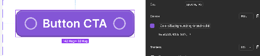

# **Audit Summary — Untitled UI Lifted as a Design System**

**Source:** [Untitled UI PRO VARIABLES v8.0](https://www.figma.com/design/QERVV4a2Fpa1FmsZ5LGW3S)  
**Status:** A product team built its UI by lifting components directly from Untitled UI. It looks right. It was never structured as a design system.  
**Example deep-dives audits:** [tabs-audit.md](../audits/tabs-audit.md) · [page-mock-audit.md](../audits/page-mock-audit.md)

---

## **TL;DR**

**Verdict:** Untitled UI is a strong UI kit, not a ready-made design system. Lifting its application-tier components (page headers, sidebars, tables, tabs) as shared organisms produces polished screens that **do not scale, compose, or hand off to engineering easily**.

| Root cause | Finished UI patterns were published wholesale — skipping atoms, molecules, and slot contracts |
| :---- | :---- |
| **Real workflow** | Insert → detach to change content/layout → ship → never normalise back into the library |
| **What still works** | Token aliases and icons (retarget for your brand); base components (Button, Input, Badge) with some rebuild and usage of slots |
| **What to rebuild** | Most monolith organism e.g., Page headers, sidebars, tables, filter bars, etc — reference only, not reusable as-is |
| **Figma ↔ code gap** | Team lifted from Figma; Untitled React is more decomposed but not auto-synced — no documented slot/token map. Lack or unknow code connect snippets implemented |
| **Fix** | Rebuild and reduce variants combos: **tokens → components (≤30) → patterns (≤15) → templates (product files only)**. These numbers are an approach and final variant count will surface once rebuild is done.  |

Start with the worst offenders (page headers, sidebars, tables). Publish composable parts with named slots — not finished blocks.

---

## **The problem**

The team copied **finished UI patterns** from a UI kit and published them as shared components — skipping the composable layers underneath — so every new screen requires detaching, forking, or inventing a new variant instead of assembling from documented parts.

This UI kit is not suitable to cover a growing product needs like scaling to cover new features and markets, theming for Dark mode and any new Sub brand that may arise or be acquired.

A **page header** built as a single block with multiple variants, long titles baked in, and no underlying atoms or molecules is an example of the **default outcome** of lifting Untitled UI's application-tier components as-is.

Untitled UI organises components as *examples that look ready to ship*, not by compositional depth. Multiple cases look fair enough, but are impossible to configure, compose and edit without detaching or breaking them.

---


## **Where the organism-based approach breaks down**

### **1\. Wrong thing at the wrong layer**

Real organisms should be **compositions with slots** — e.g. `PageHeader = title + breadcrumbs + actions`, where each slot accepts atoms/molecules.

What Untitled UI offers are **monolithic templates**: layout, sample copy, icon placement, and density fused into one component. Changing the title length, removing a breadcrumb, or swapping an action button means detaching the whole block — not toggling a prop or swapping a child instance.

### **2\. Variants encode content, not structure**

Untitled UI's Figma components carry extreme variant counts (Buttons: 940, Tabs: 280, Tables: 204). Many variants represent **content permutations** — specific title lengths, icon combos, sample data — not structural options.

A page header with several variants is doing the work that **slots and child or sub-components** should do. Every new layout permutation becomes another variant or another detached fork.

### **3\. Lack of atoms or molecules to compose**

Without published primitives below the organism layer:

* Designers cannot assemble new patterns — only pick the closest match or detach  
* Engineers cannot map Figma to code — no prop/slot contract exists  
* AI tooling cannot reason about parts — it sees opaque monoliths, not `title` \+ `actions` \+ `meta`

What the React library Untitled UI ships (`base/`[,](https://www.untitledui.com/react/AGENT.md) `application/` [structure](https://www.untitledui.com/react/AGENT.md)) is **more decomposed than the Figma kit**. Figma and code are not aligned — and the team lifted from Figma.

### **4\. Instance swap is not an API**

Untitled UI based the props on instance swap (Figma feature). That works in a Figma UI kit. It fails as a design system contract because swap targets are implicit, undocumented, and unmappable to engineering props without reverse-engineering each variant. There is no universal instanceSwap API in UI frameworks. There has to be extra work to map those props. So it's definitely better to use Slot/children pattern instead since they map natively.

### **5\. Detachment is accepted as part of the workflow**

Because organisms are monolithic, the actual process is:

1. Insert component → 2\. Detach to change copy/layout → 3\. Ship screen → 4\. Never normalise back into the library

The result is a **distributed monolith**: visually consistent, architecturally fragmented.

---

## **What doesn't scale**

| Pressure | What happens |
| ----- | ----- |
| New screen layouts | New variant or new detached fork — not composition |
| Title/content length changes | Baked into variants; truncation rules are undocumented |
| Multiple teams | Each team picks "close enough" variants; no canonical version |
| Pages examples | All are templates that can’t be leveraged from a composition POV |
| Rebrand/token change | Alias bindings break on detached frames; manual QA everywhere |
| Dark mode | Works on instanced kit components; breaks on detached overrides |
| Engineering handoff | Receives frame structure, not component API |
| AI-assisted design/dev | Cannot reliably pick, extend, or generate from undocumented monoliths |

---

## **What can't be reused**

| Lifted as-is | Verdict |
| ----- | ----- |
| Icons, token aliases | ✅ Reusable — retarget alias → primitive for the brand |
| Button, Input, Badge (base tier) | ⚠️ Partial — rebuild with fewer variants \+ slots  (Buttons: 940, Tabs: 280, Tables: 204 variants) |
| Page header, Sidebar, Table, Filter bar | ❌ Reference only — product-specific rebuild required |
| Marketing sections, page examples | ❌ Never published as part of DS |

**Rule of thumb:** if a "component" contains sample copy, fixed title lengths, or layout decisions specific to one screen, it is a **template**, not a reusable component.

---

## **Tokens — the one thing Untitled UI got right, but lifting breaks easily**

Untitled UI PRO VARIABLES has a proper three-tier model: **primitives → semantic aliases → component bindings**. The [variables documentation](https://www.figma.com/design/QERVV4a2Fpa1FmsZ5LGW3S?node-id=6520-73435) explicitly warns against component-specific variables. Which is understandable because token explosion is a known risk, but they are very useful when assembling theming a brand espcifics overrides.

The problem is not missing semantics. It is **the fragility on lift**:

* Detached organisms bypass alias bindings  
* Monolithic variants may get hardcoded fills and local overrides  
* Figma aliases have no 1:1 map to code (React uses separate Tailwind token names)  
* Alias vocabulary is Untitled-neutral, not product-owned




The tokens map is very troublesome and hard to understand. It’s possible that you need a separate tool to manage the mapping. Also, there’s no abstraction to a JSON or TOML file that would ensure the mapping to the proper names, while the transformation tool (e.g., Style dictionary) manages the rest.

---

## **What's missing — structure and documentation**

**Structure**

* Published atoms and molecules (label, input, button, breadcrumb…). Or making them private but using them as the default children  
* Slot-based organisms with named, typed child regions  
* Separation of components, patterns, and templates  
* Variant budgets — if a variant encodes content, it is an example, not a variant

**Documentation** (none of this exists today in a usable form)

* Component anatomy — what parts exist, which are required  
* Props / slots / API mapping (Figma ↔ code)  
* Do / don't , when to use which pattern  
* Content specs — max label length, truncation, empty states, spacing  
* State coverage — hover, focus, disabled, error, loading per component  
* Accessibility notes per component  
* Owners, versioning, and deprecation policy

Without this, designers are the documentation. Engineers build parallel implementations. AI tools guess.

---

## **Verdict**

Untitled UI is a good **UI kit** for shipping screens fast. Used as a **design system foundation without restructuring**, it produces exactly the situation described: organism-level monoliths that look polished but cannot scale, compose, or hand off reliably.

The fix is not renaming folders. It is **rebuilding and removing variants**:

```
Tokens (own the alias layer)
  → Components ≤30 (Button, Input, Badge — few variants, slots)
    → Patterns ≤15 (documented, product-owned shells)
      → Templates (in product files only, never published)
        → Reference (Untitled UI examples — inspiration, not instancing)
```

It’s highly recommended to: 

* Start with the worst offenders: page headers, sidebars, and tables.   
* Extract the visual language.   
* Rebuild with slots.   
* Publish the parts, not the finished block.

