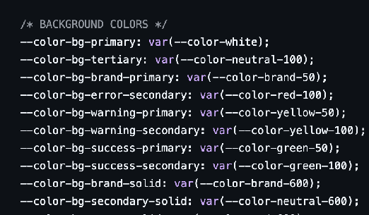

# Audit — Untitled UI Lifted as a Design System

**Source:** [Untitled UI PRO VARIABLES v8.0](https://www.figma.com/design/QERVV4a2Fpa1FmsZ5LGW3S)  
**Example deep-dives audits:** [untitled-ui-tabs-audit.md](../audits/untitled-ui-tabs-audit.md) · [page-mock-audit.md](../audits/page-mock-audit.md) · [filter-group-audit.md](../audits/filter-group-audit.md) · [table-audit.md](../audits/table-audit.md) · [tabs-group-audit.md](../audits/tabs-group-audit.md)

---

## Verdict  **TL;DR**

Untitled UI is a strong **UI kit** for shipping screens fast. Used as a **design system foundation without restructuring**, it produces organism-level monoliths that look polished but cannot scale, compose, or hand off reliably.

| Root cause | Finished UI patterns published wholesale — skipping atoms, molecules, and slot contracts |
| :---- | :---- |
| **Real workflow** | Insert → detach to change content → ship → never normalise back into library |
| **What still works** | Token aliases and icons; base components (Button, Input, Badge) with some rebuild |
| **What to rebuild** | Monolith organisms: page headers, sidebars, tables, filter bars |
| **Figma ↔ code gap** | Team lifted from Figma; Untitled React is more decomposed but not synced — no prop/slot map |
| **Fix** | Tokens → Components (≤30) → Patterns (≤15) → Templates (product files only) |

---

## **The problem**

The team copied **finished UI patterns** from a UI kit and published them as shared components — skipping the composable layers underneath — so every new screen requires detaching, forking, or inventing a new variant instead of assembling from documented parts.

This UI kit is not suitable to cover a growing product needs like scaling to cover new features and markets, theming for Dark mode and any new Sub brand that may arise or be acquired.

A **page header** built as a single block with multiple variants, long titles baked in, and no underlying atoms or molecules is an example of the **default outcome** of lifting Untitled UI's application-tier components as-is.

Untitled UI organises components as *examples that look ready to ship*, not by compositional depth. Multiple cases look fair enough, but are impossible to configure, compose and edit without detaching or breaking them.

---

## Why it breaks down

**1. Variants encode content, not structure.** Untitled UI carries extreme variant counts (Buttons: 940, Tabs: 280, Tables: 204). Most represent content permutations — specific title lengths, icon combos, sample data — not structural options. Every new layout becomes another variant or a detached fork.

**2. No atoms or molecules to compose.** Without published primitives below the organism layer, designers can only pick the closest match or detach. Engineers receive frame structure, not a component API. There is no prop/slot contract to map to code.
What the React library Untitled UI ships (`base/`[,](https://www.untitledui.com/react/AGENT.md) `application/` [structure](https://www.untitledui.com/react/AGENT.md)) is **more decomposed than the Figma kit**. Figma and code are not aligned — and the team lifted from Figma.

**3. Instance swap is not an API.** Swap targets are implicit, undocumented, and unmappable to engineering props. Slot/children patterns map natively to UI frameworks; instance swap does not.

**4. Detachment is the workflow.** Because organisms are monolithic, the actual process is: insert → detach to change copy/layout → ship → never normalise back. The result is a distributed monolith: visually consistent, architecturally fragmented.

---

## What doesn't scale

| Requirement | What happens |
| ----- | ----- |
| New screen layouts | New variant or detached fork — not composition |
| Title/content length changes | Baked into variants; truncation rules undocumented |
| Multiple teams | Each picks "close enough"; no canonical version |
| Rebrand / token change | Alias bindings break on detached frames; manual QA everywhere |
| Dark mode | Works on instanced components; breaks on detached overrides |
| Engineering handoff | Receives frame structure, not component API |

---

## What can be reused

| Component | Verdict |
| ----- | ----- |
| Icons, token aliases | ✅ Reusable — retarget alias → primitive for the brand |
| Button, Input, Badge | ⚠️ Partial — rebuild with fewer variants + slots |
| Page header, Sidebar, Table, Filter bar | ❌ Reference only — product-specific rebuild required |
| Marketing sections, page examples | ❌ Never part of the DS |

**Rule of thumb:** if a component contains sample copy, fixed title lengths, or layout decisions specific to one screen, it is a template — not a reusable component.

---

## Tokens — right structure, fragile on lift

Untitled UI PRO VARIABLES has a proper three-tier model: **primitives → semantic aliases → component bindings**. The structure is sound. The fragility is on lift:

- Detached organisms bypass alias bindings
- Monolithic variants accumulate hardcoded fills and local overrides
- Figma aliases have no 1:1 map to code (React uses separate Tailwind token names)
- No abstraction to JSON/TOML + transformation tool (e.g., Style Dictionary) to manage the mapping




---

## What's missing

**Structure**
- Published atoms and molecules (label, input, button, breadcrumb…)
- Slot-based organisms with named, typed child regions
- Separation of components, patterns, and templates
- Variant budgets — if a variant encodes content, it is an example, not a variant

**Documentation** (none exists today)
- Component anatomy and props/slots API (Figma ↔ code)
- Do/don't, when to use which pattern
- Content specs — max label length, truncation, empty states
- State coverage — hover, focus, disabled, error, loading per component
- Accessibility notes, owners, versioning, deprecation policy

---

## Recommended path

```
Tokens (own the alias layer)
  → Components ≤30 (Button, Input, Badge — few variants, slots)
    → Patterns ≤15 (documented, product-owned shells)
      → Templates (product files only — never published)
        → Reference (Untitled UI — inspiration, not instancing)
```

Start with the worst offenders: **page headers, sidebars, tables**. Extract the visual language, rebuild with slots, publish the parts — not the finished block.
