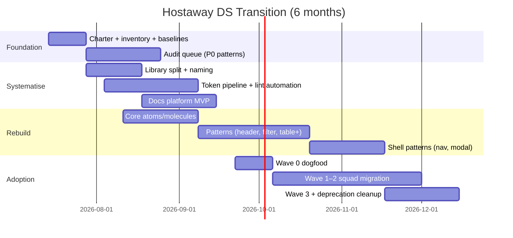

# Initial Roadmap — From Untitled UI Lift to Hostaway Design System

**Horizon:** 3–6 months (July–December 2026)  
**Context:** [Audit summary](./audit-summary.md)  · [Page mock audit](../audits/page-mock-audit.md) (A− pilot)  
**Assumption:** 1 design-system lead (0.5–1 FTE), 1 engineer (0.25–0.5 FTE), design + eng champions in 2–3 squads. Adjust scope if capacity is lower.

---

## Where we are today

| Area | State | Evidence |
|---|---|---|
| **Figma — Page header, Table & filters - pilot pattern** | On track | `Template / Page table` composes slot-driven organisms (Page header, Filter group, Table) — **A−** ([page-mock-audit.md](../audits/page-mock-audit.md)) |
| **Figma — bulk of product** | Lifted Untitled UI | Monolithic application-tier components, variant explosion, detach-heavy workflow ([audit-summary.md](./audit-summary.md)) |
| **Tokens** | Untitled alias layer exists; eroded on lift | Detached frames, hardcoded fills, Figma ↔ code name drift |
| **Code** | Likely parallel to Figma lift | Untitled React is *more decomposed* than lifted Figma — parity gap ([tabs-audit.md](../audits/tabs-audit.md)) |
| **Documentation** | Audit series only | No component docs site, no contribution model, no deprecation policy |
| **Automation** | Skill + rubric defined | Live lint scores pending |

**Strategic shift:** Stop treating Untitled UI as the design system. Treat it as **reference**. The product system is **tokens → components → patterns → templates**, with Figma slot contracts aligned to code APIs.

---

## Target end state (month 6)

```
┌─────────────────────────────────────────────────────────────────┐
│  HOSTAWAY DESIGN SYSTEM (owned, versioned, measurable)          │
├─────────────────────────────────────────────────────────────────┤
│  Tokens        Product alias layer; Figma ↔ CSS/Tailwind map    │
│  Components    ≤30 core; reduce variant count               │
│  Patterns      ≤15 slot-contracted shells (table, nav, modal…)  │
│  Templates     Product files only — never published             │
│  Reference     Untitled UI v8 — read-only, unpublishable        │
├─────────────────────────────────────────────────────────────────┤
│  Operations    Audit cadence, lint gates, owners, changelog     │
│  Adoption      2 squads fully migrated; 80%+ new work on DS   │
└─────────────────────────────────────────────────────────────────┘
```

---

## Operating principles (non‑negotiable)

These prevent ad hoc fixes from becoming the permanent process:

1. **No publish without a contract** — anatomy, slots/props, variant budget, code mapping, owner.
2. **Variants encode structure, not content** — sample copy and layout permutations live in examples, not component sets.
3. **Code API is source of truth for behavior** — Figma owns composition and visual spec; sorting, validation, and data binding live in code.
4. **One canonical path** — the `Template / Page table` stack is the reference architecture; new work extends it, not parallel kit forks.
5. **Measure detachment** — detached instances and orphan properties are tracked metrics, not one-off cleanups.
6. **Migrate in place, deprecate explicitly** — old lifted components get a sunset date; no silent dual libraries.

---

## Phase 0 — Foundation (weeks 1–2)

**Goal:** Turn audits into a repeatable program with owners, scope, and baselines.

### Deliverables

| Deliverable | Owner | Output |
|---|---|---|
| DS charter | Design + Eng leadership | Scope, decision rights, what is *in* vs *out* of the system |
| Component inventory | DS lead | Spreadsheet: every published Figma component + code equivalent + tier + status |
| Migration registry | DS lead | `Lifted` / `Rebuild in progress` / `Canonical` / `Deprecated` per asset |
| Baseline metrics | DS lead + Eng | Detached-instance %, orphan-property count, alias compliance (see § Audit automation) |
| Library split plan | Design | Core / Patterns / Reference file structure |

### Audit the rest of UI / infrastructure — systematic approach

Do **not** audit screen-by-screen. Audit **by tier and traffic**, using the same methodology as existing deep-dives.

#### 1. Figma inventory pass (week 1)

Scan the Hostaway library and top product files:

| Scan | Tool / method | What you learn |
|---|---|---|
| Published component census | Figma API / Bridge | Count, tier, variant count per asset |
| Detachment rate | `figma_lint_design` + manual sample | % of instances detached in last 20 shipped screens |
| Alias compliance | Variable binding export | Components still on raw primitives vs aliases |
| Orphan properties | Bridge script ([SKILL.md](../.cursor/skills/figma-atomic-audit/SKILL.md)) | Properties panel ≠ layer tree |
| Page-tier leakage | Components page audit | Templates or demos published as components |

**Prioritisation matrix** (audit in this order):

| Priority | Category | Why |
|---|---|---|
| P0 | Shell patterns (nav, modal, page header, table, forms) | Highest reuse; worst lift damage |
| P1 | Base components (Button, Input, Select, Badge) | Token propagation depends on these |
| P2 | Domain molecules (date picker, file upload, status chips) | Feature velocity blockers |
| P3 | Marketing / one-off | Demote to reference; exclude from DS |

#### 2. Code inventory pass (week 1–2)

Parallel track — map **what ships in production**, not what exists in node_modules:

| Scan | Method | What you learn |
|---|---|---|
| Component usage | Static analysis (imports from `@/components`, UI kit paths) | Actual adoption vs available DS |
| Duplication | Grep for parallel Button/Table/Modal implementations | Shadow components bypassing DS |
| Token source | Tailwind config / CSS variables / theme files | Figma alias ↔ code name map |
| Storybook / docs | If present, gap analysis | Doc coverage vs Figma publish set |
| Test + a11y | Existing test patterns per component | Baseline for rebuild acceptance criteria |

#### 3. Product surface sampling (week 2)

Pick **5 representative flows** (not 50 screens):

- List + filter + table (already partially modeled)
- Detail / edit form
- Settings / preferences
- Empty + error + loading states
- Modal / drawer workflow

For each flow, score: **% instanced from library vs detached vs bespoke**. This yields the adoption baseline and the migration backlog.

#### 4. Deep-dive audits (ongoing, 2 per week)

Use the [figma-atomic-audit skill](../.cursor/skills/figma-atomic-audit/SKILL.md). Each audit produces a markdown spec (like [tabs-audit.md](../audits/tabs-audit.md)) with:

- Atomic tier map
- Slot/property contract
- Variant budget vs Untitled source
- Figma ↔ code parity score
- Rebuild / keep / deprecate verdict

**Month 1 audit queue (suggested):** Sidebar nav · Modal / dialog · Form field group · Dropdown / select · Pagination · Empty state · Toast / alert.

---

## Phase 1 — Systematise (weeks 3–8)

**Goal:** Replace heroics with infrastructure — the system maintains itself.

### 1.1 Governance model

| Ritual | Cadence | Participants | Outcome |
|---|---|---|---|
| DS office hours | Weekly, 30 min | All designers + eng | Unblock usage; no new variants without review |
| Component review | Before every publish | DS lead + 1 eng + 1 designer | Contract checklist passed |
| Migration triage | Bi-weekly | Squad leads | Prioritise screens moving off lifted assets |
| Kit diff review | On Untitled upgrade only | DS lead | No auto-merge from vendor file |

**Publish checklist** — required before any component leaves draft:

1. Anatomy diagram  
2. Variant matrix (within budget)  
3. Slot / prop table (Figma ↔ code)  
4. Do / don't  
5. Accessibility notes  
6. Content specs (truncation, max lengths)  
7. Owner + version + deprecation date if replacing an asset  

### 1.2 Library architecture

Split Figma into governed files (aligns with Untitled's own guidance):

| File | Contents | Publish? |
|---|---|---|
| `Hostaway — Core` | Tokens, icons, atoms, molecules (Button, Input…) | ✅ |
| `Hostaway — Patterns` | Page header, Filter group, Table, Sidebar… | ✅ |
| `Hostaway — Product` | Templates, page mocks, feature WIP | ❌ (team files) |
| `Hostaway — Reference` | Untitled UI v8 examples, marketing | ❌ (read-only) |

**Naming convention:** `_Prefix.Name` for atoms/molecules; no `Frame 26` on published nodes ([page-mock-audit.md](../audits/page-mock-audit.md)).

### 1.3 Token pipeline

Single owned pipeline — do not rebuild Untitled's three-tier model, **own** it:

```
Primitive (brand palette)
  → Semantic alias (text-secondary, bg-primary)
    → Component binding (button/background)
      → Code token (--color-text-subtle / Tailwind theme)
```

**Deliverables by week 8:**

- Token decision log (rename or keep Untitled alias names)  
- Figma variables ↔ code export script or manual sync doc  
- Lint rule: no hardcoded fills on published components  

### 1.4 Variant budgets (enforced)

| Component | Untitled UI | Budget | Status |
|---|---|---|---|
| Button | 940 | ≤ 24 | Rebuild |
| Tabs | 280 | ≤ 16 | Spec done ([tabs-audit.md](../audits/tabs-audit.md)) |
| Table | 204 | ≤ 12 + slots | Pilot done ([page-mock-audit.md](../audits/page-mock-audit.md)) |
| Modal | ~150 | ≤ 8 + slots | Audit Q1 |
| Sidebar | 184 | Pattern, not component | Audit Q1 |

**Rule:** PR / review rejects variant axes that encode content (sample rows, title lengths, icon combos).

### 1.5 Documentation platform

Minimum viable docs site (Storybook, Zeroheight, Supernova, or repo markdown + static site):

- One page per canonical component/pattern  
- Auto-link from Figma component description → doc URL  
- Changelog per release (`DS v0.3.0 — Table cell molecules added`)  

The audit markdown in this repo becomes **draft specs**; published docs are the consumer-facing layer.

### 1.6 Audit automation

Close the gaps in the audit:

| Automation | Frequency | Gate |
|---|---|---|
| `figma_lint_design` on Core + Patterns | Weekly | Alias + a11y regressions |
| Orphan property scan | On every publish | Block publish |
| Detached instance report | Weekly on product files | Flag to squad lead if > threshold |
| Variant count export | On every publish | Block if over budget |

Use the [figma-atomic-audit skill](../.cursor/skills/figma-atomic-audit/SKILL.md) for deep-dives; use lint for **breadth**.

---

## Phase 2 — Rebuild & align (weeks 5–14, overlaps Phase 1)

**Goal:** Canonical Figma and code for high-traffic primitives and patterns.

### 2.1 Rebuild sequence

Work in **dependency order**, not screen order:

```
Week 5–6   Tokens + Button + Input + Badge + Icon button
Week 7–8   Tabs, Breadcrumbs, Dropdown (molecules)
Week 9–10  Page header, Filter group (extend pilot)
Week 11–12 Data table hardening (pagination, empty/error slots)
Week 13–14 Sidebar shell, Modal shell
```

**Per component workflow:**

1. Audit (markdown spec)  
2. Figma rebuild in Core or Patterns file  
3. Code implementation (match compound / slot API)  
4. Doc page + example in Storybook  
5. Mark old lifted asset `Deprecated` with migration note  
6. Pilot squad validates on one real screen  

### 2.2 Figma ↔ code parity strategy

| Layer | Parity target | Owner |
|---|---|---|
| Slot names | ~85% 1:1 | Design (Figma) + Eng (prop names) |
| Visual states (hover, focus, disabled) | ~75% | Design |
| Behavior (sort, validate, async) | Code only | Eng — documented in spec |

**Decision point (week 6):** Confirm stack — Untitled React as starting point vs greenfield (Lit/web components). Either works if slot naming is shared; greenfield improves long-term parity, Untitled React is faster for month 3 delivery.

### 2.3 Migration waves

| Wave | Scope | Success criteria |
|---|---|---|
| **Wave 0** (week 8) | DS team dogfoods `Template / Page table` on 1 shipping screen | Zero detaches; eng uses mapped components |
| **Wave 1** (week 10) | Squad A — list/table-heavy flows | 100% instanced header + filter + table |
| **Wave 2** (week 14) | Squad B — forms + settings | Core inputs + modals on DS |
| **Wave 3** (month 5–6) | Remaining squads | Lifted assets only on deprecated screens |

---

## Phase 3 — Drive adoption (weeks 6–24, continuous)

Adoption fails when the system is "available" but slower than detaching. Optimise for **path of least resistance**.

### 3.1 Design adoption

| Lever | Tactic |
|---|---|
| **Make DS the default** | Figma library permissions: Core + Patterns enabled; Reference only for inspiration |
| **Remove the escape hatch** | Unpublish worst monoliths; keep deprecated assets 30 days with "Use X instead" in description |
| **Templates over scratch** | Ship 3–5 page templates (list, detail, settings) that compose patterns — designers start from template, not blank frame |
| **Office hours → office hours + Loom** | 5-min "how to compose a page header" clips linked from Figma descriptions |
| **Champion network** | 1 designer per squad trained to review PRs for detach/variant abuse |
| **Critique rubric** | Design critique asks: "Could this be instanced? Which slot?" |

**Adoption metrics (design):**

- % new frames using canonical organisms (target: 80% by month 6)  
- Detached instance count per shipped screen (target: ↓ 50% by month 4, ↓ 80% by month 6)  
- Time-to-first-screen from template vs blank (qualitative; should decrease)  

### 3.2 Engineering adoption

| Lever | Tactic |
|---|---|
| **Codegen / import path** | Single import (`@hostaway/ui` or agreed path); no direct Untitled paths in new code |
| **Lint in CI** | ESLint rule: block imports from deprecated kit paths; require DS components in `apps/web` |
| **Pair on contracts** | Eng reviews Figma slot names before publish — catches `Actions slot` vs `actions` drift early |
| **Storybook as contract test** | Every pattern has stories matching Figma examples (team list, empty table, error state) |
| **Migration codemods** | For Button/Input renames — one-click upgrade for Wave 1 squad |
| **Definition of Done** | "Uses DS component or linked ADR explaining exception" |

**Adoption metrics (engineering):**

- DS component import % in touched files (target: 70% by month 5)  
- Count of shadow/duplicate components (target: zero net new after month 3)  
- Storybook coverage for canonical patterns (target: 100% of Patterns file)  

### 3.3 Cross-functional rituals

| Ritual | Purpose |
|---|---|
| **Weekly DS changelog** (Slack) | What shipped, what's deprecated, what to use instead |
| **Monthly show-and-tell** | Squad demos migrated screens — social proof |
| **Quarterly health report** | Metrics dashboard: detachment, variant counts, lint failures, adoption by squad |
| **Exception process** | ADR for one-off UI — reviewed monthly; 90% should not become new library components |

---

## Timeline overview



### 3-month checkpoint (October 2026)

**Realistic if capacity is ~1 FTE blended:**

- ✅ Audit complete for P0 + P1 (8–10 deep-dives)  
- ✅ Core file live: tokens, Button, Input, Badge, Tabs  
- ✅ Patterns file: Page header, Filter group, Table (pagination + empty slots)  
- ✅ Docs MVP + weekly lint  
- ✅ 1 squad fully on Wave 1  
- ⚠️ Sidebar / modal may still be in rebuild — defer if capacity limited  

### 6-month checkpoint (January 2027)

- ✅ ≤30 canonical components, ≤15 patterns  
- ✅ Reference file separated; lifted monoliths deprecated  
- ✅ 2–3 squads migrated; 80%+ new work on DS  
- ✅ Figma ↔ code slot map documented for all patterns  
- ✅ Quarterly metrics show ↓ detachment, stable variant counts  

---

## Risk register

| Risk | Likelihood | Mitigation |
|---|---|---|
| Feature pressure bypasses DS | High | Exception ADR; leadership backs "no new lifted publishes" |
| Figma–code drift | High | Shared slot naming doc; eng sign-off on publish |
| Untitled UI upgrade breaks aliases | Medium | Pin v8; diff before merge; never auto-update |
| Under-resourced DS team | High | Ruthless scope: patterns before polish; defer marketing |
| Designers faster detaching than composing | Medium | Templates + unpublished monoliths + champions |
| Eng rebuild slower than Figma | Medium | Use Untitled React as scaffold; refactor to budget |

---

## What we are explicitly not doing (first 6 months)

- Rebuilding every Untitled UI component (10k+ variants)  
- Perfect pixel parity between Figma interactions and runtime behavior  
- Marketing site components in product DS  
- Big-bang migration of all historical screens  
- Renaming every token unless eng and Figma commit to sync  

---

## Immediate next steps (this week)

1. **Approve charter** — scope, owners, 6-month success metrics.  
2. **Run inventory pass** — Figma published set + code import graph.  
3. **Baseline detachment** — sample 20 recent screens.  
4. **Schedule audit queue** — Sidebar nav and Modal next (highest gap after table pilot).  
5. **Confirm code stack decision** — Untitled React extend vs greenfield wrapper (week 6 deadline).  
6. **Dogfood** — one squad commits to Wave 0 on a real Q3 ship.  

---

## Related artifacts

| Doc | Role in roadmap |
|---|---|
| [audit-summary.md](./audit-summary.md) | Problem statement |
| [page-mock-audit.md](../audits/page-mock-audit.md) | Reference implementation to replicate |
| [tabs-audit.md](../audits/tabs-audit.md) | Rebuild spec example |
| [figma-atomic-audit skill](../.cursor/skills/figma-atomic-audit/SKILL.md) | Repeatable audit workflow |

---

*Roadmap v1 — July 2026. Revisit at 3-month checkpoint; adjust scope if team capacity differs from assumptions.*
